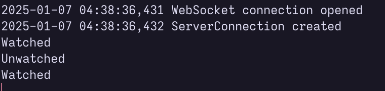
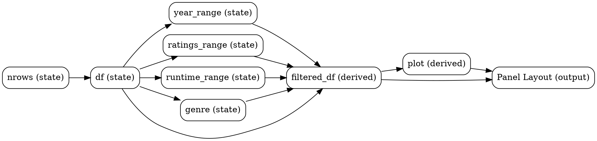

:::div{.cell}
<details class="code-fold">
<summary>Code</summary>

``` {.python .cell-code}
################################################################################

# autoreload all modules every time before executing the Python code
%reload_ext autoreload
%autoreload 2

################################################################################

from IPython.core.interactiveshell import InteractiveShell

# `ast_node_interactivity` is a setting that determines how the return value of the last line in a cell is displayed
# with `last_expr_or_assign`, the return value of the last expression is displayed unless it is assigned to a variable
InteractiveShell.ast_node_interactivity = "last_expr_or_assign"

################################################################################

import pandas as pd

# `copy_on_write` is a performance improvement
# This will be the default in a future version of pandas
# Refer to https://pandas.pydata.org/pandas-docs/stable/user_guide/copy_on_write.html
pd.options.mode.copy_on_write = True
pd.options.future.no_silent_downcasting = True

################################################################################

%matplotlib inline

import matplotlib as mpl

mpl.use("agg")

# `constrained_layout` helps avoid overlapping elements
# Refer to https://matplotlib.org/stable/tutorials/intermediate/constrainedlayout_guide.html
mpl.pyplot.rcParams["figure.constrained_layout.use"] = True
```

</details>
:::

<div>

::: callout-note

The UI elements in this post are not interactive as this is a static
page. To see the interactive elements, please run the notebook in a
Jupyter environment.

:::

</div>

:::div{.cell}
<details class="code-fold">
<summary>Code</summary>

``` {.python .cell-code}
import holoviews as hv
import hvplot.pandas  # noqa
import pandas as pd
import panel as pn
import param

pn.extension("tabulator")
hv.extension("bokeh")
```

</details>
:::

[`panel`](https://panel.holoviz.org/) is a library that allows creating
interactive dashboards in pure Python. It's a flexible library that
allows interlinking matplotlib, bokeh, widgets, and more.

There are however many ways to use `panel`, some of which are better for
certain use cases. I wanted to write this post to share the way I use
`panel`.

## Development Constraints

My first constraint when using `panel` was that I wanted to develop the
dashboard in an interactive manner, preferably using a Jupyter notebook
environment. `panel` does allow starting a server using the
`panel serve --autoreload` command and you can pass in the path to a
file or a jupyter notebook. However, I want to prototype individual
components in a Jupyter notebook, but once I'm happy with the
components, I want to combine them into a dashboard. With multiple
components like this, using global variables gets unwieldy.
Additionally, for multi-page dashboards, I don't want to have to store
different components in different files and run multiple servers.

My second constraint was that I wanted to make the dashboard as modular
as possible. I wanted to be able to reuse some components across
different dashboards. For example, I might have a component that shows a
line chart and I want to use that line chart in a "user guide page" as
well as in the "home page".

Lastly, I wanted the code to be usable in a Python script in case
someone wanted to programmatically access the same features. Imagine if
a user wanted to plot the line chart from the dashboard and annotate it
with some custom text. I wanted to make it easy for an advanced user
that wanted to do that to have the option to do so. This also means that
I wanted to make it easy to test the components in a CI/CD pipeline.

The most natural way to do this was to make the components as classes
and then instantiate them as part of the dashboard. This also requires
the "state" and the "view" to be separate. In this post we are going to
talk specifically about that approach. We'll use the IMDb movies dataset
as an example to build a dashboard.

## Jupyter prelude

When working in a Jupyter notebook, autoreloading modules is a feature
that can be very useful. This means you can make a python package and
import the package in the notebook, prototype components in the notebook
and move the code over to the package when you are happy with the
component. With autoreloading, you don't have to restart the jupyter
notebook kernel every time you make a change to the source code.

:::div{.cell}
``` {.python .cell-code}
# autoreload all modules every time before executing the Python code
%reload_ext autoreload
%autoreload 2
```
:::

For this example, I've made a package called `movies_dashboard` that has
the following structure:

::::div{.cell}
``` {.python .cell-code}
!eza --tree src
```

:::div{.cell-output .cell-output-display}
    src
    └── movies_dashboard
        ├── __init__.py
        ├── movies.py
        └── py.typed
:::
::::

Any changes to the files in the package will be automatically reloaded
when a new cell is run.

::::div{.cell}
``` {.python .cell-code}
import movies_dashboard as md
md.__version__
```

:::div{.cell-output .cell-output-display}
    AttributeError: module 'movies_dashboard' has no attribute '__version__'
    ---------------------------------------------------------------------------
    AttributeError                            Traceback (most recent call last)
    Cell In[5], line 2
          1 import movies_dashboard as md
    ----> 2 md.__version__

    AttributeError: module 'movies_dashboard' has no attribute '__version__'
:::
::::

That errors but after updating the version in the `__init__.py` file,
the `__version__` attribute is updated without reloading the kernel.

:::div{.cell}
``` {.python .cell-code}
!echo "__version__ = '0.1.0'" > src/movies_dashboard/__init__.py
```
:::

::::div{.cell}
``` {.python .cell-code}
md.__version__
```

:::div{.cell-output .cell-output-display}
    '0.1.0'
:::
::::

Another setting that you can enable is `last_expr_or_assign`. This makes
it such that even if the last line of a cell is an assignment, the value
of the assignment is displayed.

:::div{.cell}
``` {.python .cell-code}
from IPython.core.interactiveshell import InteractiveShell
InteractiveShell.ast_node_interactivity = "last_expr_or_assign"
```
:::

With this setting, you don't have to repeat the name of the variable at
the end of every cell to see the value of the variable.

::::div{.cell}
``` {.python .cell-code}
import pandas as pd

df = pd.read_csv("./data/title.basics.tsv.gz", sep="\t", nrows=500).head()
# df ## this line is not required to see the value of df
```

:::div{.cell-output .cell-output-display}
          tconst titleType            primaryTitle           originalTitle  \
    0  tt0000001     short              Carmencita              Carmencita
    1  tt0000002     short  Le clown et ses chiens  Le clown et ses chiens
    2  tt0000003     short            Poor Pierrot          Pauvre Pierrot
    3  tt0000004     short             Un bon bock             Un bon bock
    4  tt0000005     short        Blacksmith Scene        Blacksmith Scene

       isAdult  startYear endYear runtimeMinutes                    genres
    0        0       1894      \N              1         Documentary,Short
    1        0       1892      \N              5           Animation,Short
    2        0       1892      \N              5  Animation,Comedy,Romance
    3        0       1892      \N             12           Animation,Short
    4        0       1893      \N              1                     Short
:::
::::

## Param State

`panel` is built on top of [`param`](https://param.holoviz.org/). One
useful way to think about these two packages is that `param` is a way to
define state and `panel` is a way to visualize that state. And making
state driven components is a great way to make interactive dashboards.

With `param`, you can define the state using a class based approach:

::::div{.cell}
``` {.python .cell-code}
import param


class MoviesStateExample(param.Parameterized):
    name = param.String()
    year = param.Integer()

m = MoviesStateExample(name = "Goodfellas", year = 1990)
```

:::div{.cell-output .cell-output-display}
    MoviesStateExample(name='Goodfellas', year=1990)
:::
::::

And with `panel`, you can visualize the state:

:::::div{.cell}
``` {.python .cell-code}
import panel as pn

pn.Param(m)
```


:::div{.cell-output .cell-output-display}
    Param(MoviesStateExample, name='Goodfellas', sizing_mode='stretch_width')
:::
:::::

When making any UI it is important to identify the state variables of a
component. This usually involves understanding a few different things:

1.  What are the inputs to the component?
2.  What are the derived properties of the component?
3.  What are the outputs of the component?

This typically forms a unidirectional graph where the inputs are used to
derive the properties and the properties are used to derive the outputs.

### Identifying Inputs

Let's say we want to filter based on the year, the average ratings and
the runtime of movies. In this case, we would have one variable for the
input dataframe; and variables for the year, ratings and runtime ranges.

:::div{.cell}
``` {.python .cell-code}
class MoviesStateExample(param.Parameterized):
    input_df = param.DataFrame()

    year_range = param.Range()
    ratings_range = param.Range()
    runtime_range = param.Range()
```
:::

### Identifying Derived Properties

In this example, when the class is initialized, we may want to load the
CSV files, preprocess and clean the data. When `self.df = df` is called,
`param` will trigger an action with the name of the parameter. And any
functions that are listening to that action will be called. We can use
this feature to update any derived properties.

There are a few different ways to listen to changes in a parameter.

1.  Add a member function with the `param.depends` decorator.

::::div{.cell}
``` {.python .cell-code}
class MovieUsingDepends(param.Parameterized):
    start_year = param.Integer()
    end_year = param.Integer()
    df = param.DataFrame()

    def __init__(self, **kwargs):
        super().__init__(**kwargs)
        self.df = pd.read_csv("./data/title.basics.tsv.gz", sep="\t", nrows=500)

    @param.depends("df", watch=True)
    def _update_bounds(self):
        self.start_year = int(self.df["startYear"].min())
        self.end_year = int(self.df["startYear"].max())


m = MovieUsingDepends()
print(dict(start=m.start_year, end=m.end_year))
```

:::div{.cell-output .cell-output-display}
    {'start': 1892, 'end': 1912}
:::
::::

2.  Use `pm.bind` with the `watch=True` argument.

::::div{.cell}
``` {.python .cell-code}
class MovieUsingBind(param.Parameterized):
    start_year = param.Integer()
    end_year = param.Integer()
    df = param.DataFrame()

    def __init__(self, **kwargs):
        super().__init__(**kwargs)
        param.bind(self._update_bounds, self.param.df, watch=True)
        self.df = pd.read_csv("./data/title.basics.tsv.gz", sep="\t", nrows=500)

    def _update_bounds(self, df):
        self.start_year = int(self.df["startYear"].min())
        self.end_year = int(self.df["startYear"].max())


m = MovieUsingBind()
print(dict(start=m.start_year, end=m.end_year))
```

:::div{.cell-output .cell-output-display}
    {'start': 1892, 'end': 1912}
:::
::::

3.  Use `self.param.watch` in the `__init__` function.

::::div{.cell}
``` {.python .cell-code}
class MovieUsingWatch(param.Parameterized):
    start_year = param.Integer()
    end_year = param.Integer()
    df = param.DataFrame()

    def __init__(self, **kwargs):
        super().__init__(**kwargs)
        self.param.watch(self._update_bounds, "df")
        self.df = pd.read_csv("./data/title.basics.tsv.gz", sep="\t", nrows=500)

    def _update_bounds(self, event):
        if event.name == "df":
            df = event.new
            self.start_year = int(self.df["startYear"].min())
            self.end_year = int(self.df["startYear"].max())


m = MovieUsingWatch()
print(dict(start=m.start_year, end=m.end_year))
```

:::div{.cell-output .cell-output-display}
    {'start': 1892, 'end': 1912}
:::
::::

<div>

::: callout-tip

`@param.depends` decorator with `watch=True` is the simplest because
it is more explicit and easier to read.

:::

</div>

In all cases, when you use `watch=True`, you have created a dependent
function, and any properties that are updated in that function are
dependent properties.

### Outputs

Finally, it is important to define the outputs of the component. In this
case, the outputs is a derived component that represents the filtered
dataframe.

::::div{.cell}
``` {.python .cell-code}
class MovieWithOutputs(param.Parameterized):
    start_year = param.Integer()
    end_year = param.Integer()
    df = param.DataFrame()

    def __init__(self, **kwargs):
        super().__init__(**kwargs)
        self.df = pd.read_csv(
            "./data/title.basics.tsv.gz",
            sep="\t",
            usecols=["primaryTitle", "startYear"],
            nrows=200,
        )

    @param.depends("df", watch=True)
    def _update_bounds(self):
        self.start_year = int(self.df["startYear"].min())
        self.end_year = int(self.df["startYear"].max())

    @param.depends("df", "start_year", "end_year")
    def output_df(self):
        df, start_year, end_year = (
            self.df,
            self.start_year,
            self.end_year,
        )
        return df.query(f"startYear >= {start_year}").query(f"startYear <= {end_year}")


m = MovieWithOutputs()
m.output_df()
```

:::div{.cell-output .cell-output-display}
| index | primaryTitle | startYear |
| --- | --- | --- |
| 0 | Carmencita | 1894 |
| 1 | Le clown et ses chiens | 1892 |
| 2 | Poor Pierrot | 1892 |
| 3 | Un bon bock | 1892 |
| 4 | Blacksmith Scene | 1893 |
| .. | ... | ... |
| 195 | La fuite en Égypte | 1898 |
| 196 | Glasgow Fire Engine | 1898 |
| 197 | Gran corrida de toros | 1898 |
| 198 | Indian War Council | 1894 |
| 199 | Le jardin des oliviers | 1898 |

[200 rows x 2 columns]
:::
::::

Returning the outputs from a function allows for easy access to the
outputs for testing, debugging and for use in other components.

On some occassions however, you might want to store the outputs as a
property to cache outputs. This is useful when the output is expensive
to compute. In the example below, the output is stored in a
`filtered_df` property and is updated whenever the `df`, `start_year` or
`end_year` changes.

::::div{.cell}
``` {.python .cell-code}
class MovieWithDependentOutputs(param.Parameterized):
    df = param.DataFrame()
    start_year = param.Integer()
    end_year = param.Integer()
    filtered_df = param.DataFrame()

    def __init__(self, **kwargs):
        super().__init__(**kwargs)
        self.df = pd.read_csv(
            "./data/title.basics.tsv.gz",
            sep="\t",
            usecols=["primaryTitle", "startYear"],
            nrows=200,
        )

    @param.depends("df", watch=True)
    def _update_bounds(self):
        self.start_year = int(self.df["startYear"].min())
        self.end_year = int(self.df["startYear"].max())

    @param.depends("df", "start_year", "end_year", watch=True)
    def _output_df(self):
        df, start_year, end_year = (
            self.df,
            self.start_year,
            self.end_year,
        )
        self.filtered_df = df.query(f"startYear >= {start_year}").query(
            f"startYear <= {end_year}"
        )


m = MovieWithDependentOutputs()
m.filtered_df
```

:::div{.cell-output .cell-output-display}
| index | primaryTitle | startYear |
| --- | --- | --- |
| 0 | Carmencita | 1894 |
| 1 | Le clown et ses chiens | 1892 |
| 2 | Poor Pierrot | 1892 |
| 3 | Un bon bock | 1892 |
| 4 | Blacksmith Scene | 1893 |
| .. | ... | ... |
| 195 | La fuite en Égypte | 1898 |
| 196 | Glasgow Fire Engine | 1898 |
| 197 | Gran corrida de toros | 1898 |
| 198 | Indian War Council | 1894 |
| 199 | Le jardin des oliviers | 1898 |

[200 rows x 2 columns]
:::
::::

### Conventions

One thing to consider is that some dependent properties may computed
only as part of the internal state of a component. These dependent
properties are usually "private" variables and are not meant to be
accessed directly.

<div>

::: callout-tip

You can signal that a property is private by prefixing the property
with an underscore. This is a convention in Python to signal that a
property is private and should not be accessed directly.

:::

</div>

:::div{.cell}
``` {.python .cell-code}
class MovieSignalingPrivateVariables(param.Parameterized):
    df = param.DataFrame()
    _start_year = param.Integer()
    _end_year = param.Integer()
    filtered_df = param.DataFrame()

    def __init__(self, **kwargs):
        super().__init__(**kwargs)
        self.df = pd.read_csv(
            "./data/title.basics.tsv.gz",
            sep="\t",
            usecols=["primaryTitle", "startYear"],
            nrows=200,
        )

    @param.depends("df", watch=True)
    def _update_bounds(self):
        self._start_year = int(self.df["startYear"].min())
        self._end_year = int(self.df["startYear"].max())

    @param.depends("df", "_start_year", "_end_year", watch=True)
    def _update_outputs(self):
        df, start_year, end_year = (
            self.df,
            self._start_year,
            self._end_year,
        )
        self.filtered_df = df.query(f"startYear >= {start_year}").query(
            f"startYear <= {end_year}"
        )


m = MovieSignalingPrivateVariables();
```
:::

## Panel View

After setting up the state of an component, we can create a view that
presents the state, derived values and the outputs.

One convention is to make this part of a `panel()` or a `view()` method
that returns the layout and initializes any `pn.widgets` in, and only
in, this method.

:::::div{.cell}
``` {.python .cell-code}
class MoviesPanel(param.Parameterized):
    df = param.DataFrame()
    start_year = param.Integer()
    end_year = param.Integer()
    filtered_df = param.DataFrame()

    def __init__(self, **kwargs):
        super().__init__(**kwargs)
        basics = pd.read_csv("./data/title.basics.tsv.gz", sep="\t", nrows=500)
        ratings = pd.read_csv("./data/title.ratings.tsv.gz", sep="\t", nrows=500)
        self.df = basics.merge(ratings, on="tconst").dropna()

    @param.depends("df", watch=True)
    def _update_bounds(self):
        self.start_year = int(self.df["startYear"].min())
        self.end_year = int(self.df["startYear"].max())

    @param.depends("df", "start_year", "end_year", watch=True)
    def _update_outputs(self):
        df, start_year, end_year = (
            self.df,
            self.start_year,
            self.end_year,
        )
        self.filtered_df = df.query(f"startYear >= {start_year}").query(
            f"startYear <= {end_year}"
        )

    def panel(self):
        return pn.Column(
            pn.Row(
                pn.widgets.IntInput.from_param(self.param.start_year, name="Start Year"),
                pn.widgets.IntInput.from_param(self.param.end_year, name="End Year"),
            ),
            pn.widgets.Tabulator.from_param(
                self.param.filtered_df, pagination="remote", page_size=5, disabled=True,
            ),
        )


m = MoviesPanel()
m.panel()
```


:::div{.cell-output .cell-output-display}
    Column(sizing_mode='stretch_width')
        [0] Row(sizing_mode='stretch_width')
            [0] IntInput(name='Start Year', sizing_mode='stretch_width', value=1892)
            [1] IntInput(name='End Year', sizing_mode='stretch_width', value=1912)
        [1] Tabulator(disabled=True, name='Filtered df', page_size=5, pagination='remote', sizing_mode='stretch_width', value=        tconst titleType  ...)
:::
:::::

When a user updates the start year or the end year, the filtered
dataframe is updated. And when that filtered data is updated, the
`Tabulator` widget is updated. This is a very simple example, but this
pattern can be extended to more complex dashboards.

<div>

::: callout-note

It is possible to also derive from `pn.viewable.Viewer` and implement
the `__panel__` method. Doing this will return the layout of the
component when the component is displayed in a notebook.

:::

</div>

Every widget in panel accepts a few different types of arguments (See
[this section in the official
documentation](https://panel.holoviz.org/tutorials/intermediate/interactivity.html#declarative)
for more information). But the two most common types are:

1.  A Parameter instance
2.  A method using `pn.bind` or `pn.depends` that returns a value

### 1. A parameter instance

It is important to understand the difference between an attribute
instance and a parameter instance. An attribute instance is the value
that most people typically deal with.

::::div{.cell}
``` {.python .cell-code}
m.start_year
```

:::div{.cell-output .cell-output-display}
    1892
:::
::::

A parameter instance on the other hand is a special instance created by
any class that inherits from `param.Parameterized`.

::::div{.cell}
``` {.python .cell-code}
m.param.start_year
```

:::div{.cell-output .cell-output-display}
    <param.parameters.Integer at 0x317027400>
:::
::::

::::div{.cell}
``` {.python .cell-code}
isinstance(m.param.start_year, param.Parameter)
```

:::div{.cell-output .cell-output-display}
    True
:::
::::

Attribute instances are implemented using descriptors. When the Python
interpreter sees `m.start_year`, it will return the value of the
attribute by called the `__get__` method of the `param.Integer`
descriptor. This returns the current state at the time of the
invocation.

::::div{.cell}
``` {.python .cell-code}
type(m.start_year)
```

:::div{.cell-output .cell-output-display}
    int
:::
::::

`m.param.start_year` on the other hand is a special value that contains
a `pm.Parameter` instance that allows enabling the reactive features.
This special value has to be passed into a widget to create a two way
binding, and this has to be done using the `from_param` method.

:::::div{.cell}
``` {.python .cell-code}
pn.widgets.IntInput.from_param(m.param.start_year)
```


:::div{.cell-output .cell-output-display}
    IntInput(name='Start year', sizing_mode='stretch_width', value=1892)
:::
:::::

### 2. A method using `pn.bind` or `pn.depends` that returns a value

There are two ways to achieve a method that functions as a callback.

a.  Using `pn.bind`

b.  Using `@pn.depends`

**a. Using `pn.bind`**

Widgets also can accept a method that is bound to a parameter. This is
useful when you want to create a widget that is dependent on another
parameter.

:::::div{.cell}
``` {.python .cell-code}
def _get_dataframe(df):
    return df.head().drop(columns=["tconst", "titleType", "isAdult", "endYear", "genres", "originalTitle"])

pn.widgets.Tabulator(pn.bind(_get_dataframe, m.param.filtered_df), disabled=True)
```


:::div{.cell-output .cell-output-display}
    Tabulator(disabled=True, sizing_mode='stretch_width', value=             p...)
:::
:::::

`pn.bind` is a way to bind a method to a parameter, and this method will
be called whenever the parameter changes.

<div>

::: callout-note

`pn.bind` is just an alias for `param.bind`.

:::

</div>

Keep in mind that `pn.bind` returns a function:

::::div{.cell}
``` {.python .cell-code}
type(pn.bind(_get_dataframe, m.param.filtered_df))
```

:::div{.cell-output .cell-output-display}
    function
:::
::::

And calling that function will return the value of the parameter at that
time.

::::div{.cell}
``` {.python .cell-code}
f = pn.bind(_get_dataframe, m.param.filtered_df);

f()
```

:::div{.cell-output .cell-output-display}
                 primaryTitle  startYear runtimeMinutes  averageRating  numVotes
    0              Carmencita       1894              1            5.7      2115
    1  Le clown et ses chiens       1892              5            5.6       285
    2            Poor Pierrot       1892              5            6.4      2148
    3             Un bon bock       1892             12            5.3       183
    4        Blacksmith Scene       1893              1            6.2      2872
:::
::::

But in Jupyter notebooks, even displaying the function will call the
function and return the value.

:::::div{.cell}
``` {.python .cell-code}
f
```


:::div{.cell-output .cell-output-display}
    <function param.reactive.bind.<locals>.wrapped(*wargs, **wkwargs)>
:::
:::::

**b. Using `@pn.depends`**

The input to a widget can also be a function or a method that is part of
the class that uses the `@pn.depends` decorator. If this decorator is
used, and when this method is passed to a widget, the method will be
called whenever the parameter changes and the return value is used to
update the UI.

In this case however, displaying the method will not call the method:

::::div{.cell}
``` {.python .cell-code}
@pn.depends(m.param.filtered_df)
def _get_dataframe(filtered_df):
    return df.head().drop(columns=["tconst", "titleType", "isAdult", "endYear", "genres", "originalTitle"])

_get_dataframe
```

:::div{.cell-output .cell-output-display}
    <function __main__._get_dataframe(filtered_df)>
:::
::::

::::div{.cell}
``` {.python .cell-code}
_get_dataframe(m.filtered_df)
```

:::div{.cell-output .cell-output-display}
                 primaryTitle  startYear runtimeMinutes
    0              Carmencita       1894              1
    1  Le clown et ses chiens       1892              5
    2            Poor Pierrot       1892              5
    3             Un bon bock       1892             12
    4        Blacksmith Scene       1893              1
:::
::::

When using `@pn.depends`, the variable (e.g. `_get_dataframe`) that
would have contained a reference to the function is replaced by a new
wrapped function which is "reactive". So in this case, you can pass the
variable directly to the widget.

:::::div{.cell}
``` {.python .cell-code}
pn.widgets.Tabulator(_get_dataframe, disabled=True)
```


:::div{.cell-output .cell-output-display}
    Tabulator(disabled=True, sizing_mode='stretch_width', value=             p...)
:::
:::::

<div>

::: callout-tip

Similar to `pn.bind` and `param.bind`, `@pn.depends` is an alias for
`@param.depends`.

:::

</div>

Here's an example of using the `@pn.depends` decorator to define a
method in a class that is used to update the UI:

:::::div{.cell}
``` {.python .cell-code}
class MoviesPanel(param.Parameterized):
    start_year = param.Integer()
    end_year = param.Integer()
    df = param.DataFrame()
    filtered_df = param.DataFrame()

    def __init__(self, **kwargs):
        super().__init__(**kwargs)
        basics = pd.read_csv("./data/title.basics.tsv.gz", sep="\t", nrows=500)
        ratings = pd.read_csv("./data/title.ratings.tsv.gz", sep="\t", nrows=500)
        self.df = basics.merge(ratings, on="tconst").dropna()

    @param.depends("df", watch=True)
    def _update_bounds(self):
        self.start_year = int(self.df["startYear"].min())
        self.end_year = int(self.df["startYear"].max())

    @param.depends("df", "start_year", "end_year", watch=True)
    def _output_df(self):
        df, start_year, end_year = (
            self.df,
            self.start_year,
            self.end_year,
        )
        self.filtered_df = df.query(f"startYear >= {start_year}").query(
            f"startYear <= {end_year}"
        )
        return self.filtered_df

    @param.depends("filtered_df")
    def _get_dataframe(filtered_df):
        return df.head().drop(columns=["tconst", "titleType", "isAdult", "endYear", "genres", "originalTitle"])

    def panel(self):
        return pn.Column(
            pn.Row(
                pn.widgets.IntInput.from_param(self.param.start_year, name="Start Year"),
                pn.widgets.IntInput.from_param(self.param.end_year, name="End Year"),
            ),
            pn.widgets.Tabulator(
                self._get_dataframe, pagination="remote", page_size=5
            ),
        )


m = MoviesPanel()
m.panel()
```


:::div{.cell-output .cell-output-display}
    Column(sizing_mode='stretch_width')
        [0] Row(sizing_mode='stretch_width')
            [0] IntInput(name='Start Year', sizing_mode='stretch_width', value=1892)
            [1] IntInput(name='End Year', sizing_mode='stretch_width', value=1912)
        [1] Tabulator(page_size=5, pagination='remote', sizing_mode='stretch_width', value=             p...)
:::
:::::

### watch=True vs watch=False

Notice that the `@pn.depends` decorator is used to define the method
`_get_dataframe` does not use the `watch=True` argument.

If the `@pn.depends` decorator uses the `watch=True` argument, the
method will be called whenever the parameter changes AND the method will
be called again when the widget needs to be updated.

If you are ever confused about this, add print or log statements to the
method to see when a method is called.

::::::div{.cell}
``` {.python .cell-code}
class WatchTrueVsFalse(param.Parameterized):
    input_data = param.String()

    @param.depends("input_data")
    def _update_dependency_unwatched(self):
        print("Unwatched")
        return "Unwatched: " + self.input_data

    @param.depends("input_data", watch=True)
    def _update_dependent_watched(self):
        print("Watched")
        return "Watched: " + self.input_data

    def panel(self):
        return pn.Column(
            pn.widgets.TextInput.from_param(self.param.input_data),
            pn.Row(pn.pane.Str(self._update_dependency_unwatched), pn.pane.Str(self._update_dependent_watched)),
        )

WatchTrueVsFalse(input_data="hello world").panel()
```

:::div{.cell-output .cell-output-display}
    Unwatched
    Watched
:::


:::div{.cell-output .cell-output-display}
    Column(sizing_mode='stretch_width')
        [0] TextInput(name='Input data', sizing_mode='stretch_width', value='hello world')
        [1] Row(sizing_mode='stretch_width')
            [0] Str(str, sizing_mode='stretch_width')
            [1] Str(str, sizing_mode='stretch_width')
:::
::::::



You can see that "Watched" is printed twice:

1.  When the input is changed
2.  When the pn.pane.Str is displayed again after the input is changed

but "Unwatched" is printed only once:

1.  When the pn.pane.Str is displayed again after the input is changed

<div>

::: callout-tip

When `watch=True` is used, it is recommended to not return anything
from that method and simply update the state of the class instead.
It's easier to reason about the code and forces using `from_param` to
bind to a derived property instead.

:::

</div>

## Example: Movies Dashboard

With just the `@param.depends` decorator, you can make any reactive
component using panel by using two way bindings to update the state and
the UI, and trigger updates to other dependencies which in turn can
update other parts of the UI.

As a more involved example, I've attached a package with a class called
`Movies` that has the following state, derived properties and outputs:



And here's what the UI looks like:

:::div{.cell}
<details class="code-fold">
<summary>Code</summary>

``` {.python .cell-code}
import movies_dashboard
```

</details>
:::

We can instantiate the `Movies` class.

:::div{.cell}
``` {.python .cell-code}
m = movies_dashboard.movies.Movies();
```
:::

And call the `panel()` method to get an interactive dashboard.

::::::div{.cell}
``` {.python .cell-code}
m.panel()
```


:::div{.cell-output .cell-output-display}
    Column(sizing_mode='stretch_width')
        [0] Row(sizing_mode='stretch_width')
            [0] RangeSlider(end=10, name='Ratings range', sizing_mode='stretch_width', step=1, value=(0, 10), value_end=10)
            [1] RangeSlider(end=2025, name='Year range', sizing_mode='stretch_width', start=1894, step=1, value=(1894, 2025), value_end=2025, value_start=1894)
            [2] RangeSlider(end=59460, name='Runtime range', sizing_mode='stretch_width', start=1, step=1, value=(1, 59460), value_end=59460, value_start=1)
        [1] Row(sizing_mode='stretch_width')
            [0] Select(name='Genre', options=OrderedDict({'Romance': 'R...]), sizing_mode='stretch_width', value='Romance')
        [2] Tabs(sizing_mode='stretch_width')
            [0] HoloViews(DynamicMap, height=400, name='Visualization', sizing_mode='fixed', width=900)
            [1] Tabulator(page_size=10, pagination='remote', sizing_mode='stretch_width', value=            tconst t...)
:::
::::::

By having methods that return subcomponents, we can easily combine them
on the fly on a case by case basis.

:::::div{.cell}
<details class="code-fold">
<summary>Code</summary>

``` {.python .cell-code}
m.genre = "Documentary"
documentary_plot = m._update_plot()
m.genre = "Comedy"
comedy_plot = m._update_plot()

m.genre = "Romance"

(documentary_plot + comedy_plot).cols(1)
```

</details>


:::div{.cell-output .cell-output-display}
    :Layout
       .BoxWhisker.I  :BoxWhisker   [startYear]   (averageRating)
       .BoxWhisker.II :BoxWhisker   [startYear]   (averageRating)
:::
:::::

The only real disadvantage of this package based approach is that it is
not straightforward to make a wasm only version of the panel dashboard,
since that requires it to be all in one file.

This approach allows making a package, using `param` to define dependent
state, create UI when required in a class based approach. In my opinion,
this lends itself to better testing, documentation and maintainability
in the long run. This is also the approach recommended in the
intermediate sections of the `panel` tutorials. Check out these links
for more information:

-   <https://panel.holoviz.org/tutorials/intermediate/parameters.html>
-   <https://panel.holoviz.org/tutorials/intermediate/interactivity.html>
-   <https://panel.holoviz.org/tutorials/intermediate/reusable_components.html>

I also wanted to shout out the `panel` and `param` developers for
creating such a flexible and powerful library. And thanks to the members
of the `holoviz` community for offering feedback and suggestions on this
post.
