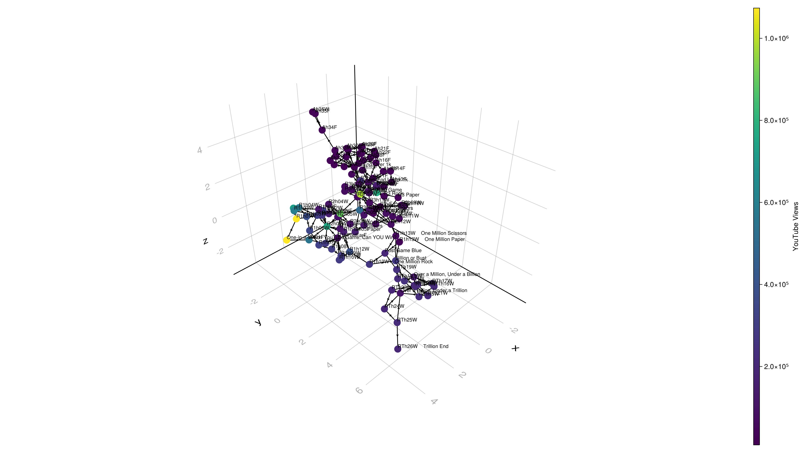
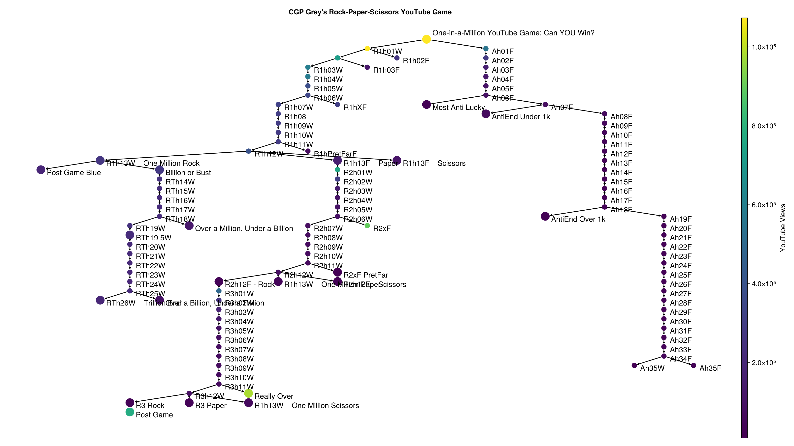

If you haven't already checked it out, go watch CGPGrey's
Rock-Paper-Scissors YouTube Game.

<https://www.youtube.com/watch?v=PmWQmZXYd74>

In this post, I'm going to explore what all the possible paths available
are. Let's import some packages first.

:::div{.cell}
``` {.julia .cell-code}
using PyCall
using Conda
using Graphs
using WGLMakie
using CairoMakie
using GraphMakie
using GraphMakie.NetworkLayout
using JSON3
using JSServe, Markdown
using ColorSchemes
Page(exportable=true, offline=true)
CairoMakie.activate!()
Makie.inline!(true)
```
:::

Fortunately for us, CGPGrey was kind enough to put links to the choices
in the description of (*almost*) every video. We can use Google's
YouTube API to get the video descriptions and get all the YouTube links
in the description.

We are going to use the `google-api-python-client` in Python from Julia.

:::div{.cell}
<details class="code-fold">
<summary>Code</summary>

``` {.julia .cell-code}
API_KEY = ENV["YOUTUBE_API_KEY"]; # Get API_KEY from google console
build = pyimport("googleapiclient.discovery").build # from googleapiclient.discovery import build
youtube = build("youtube", "v3", developerKey=API_KEY) # call build function in Python
```

</details>
:::

Now we can get the description of every video, extract the metadata from
it into a `Dict` of `Dict`s, build a graph:

:::div{.cell}
<details class="code-fold">
<summary>Code</summary>

``` {.julia .cell-code}
youtubeid(url) = string(first(split(replace(url, "https://www.youtube.com/watch?v=" => ""), "&t")))

function metadata(url)
  id = youtubeid(url)
  request = youtube.videos().list(part=["snippet", "statistics"], id=id)
  response = request.execute()
  description = response["items"][1]["snippet"]["description"]
  title = response["items"][1]["snippet"]["title"]
  views = parse(Int, response["items"][1]["statistics"]["viewCount"])
  if url == "https://www.youtube.com/watch?v=CPb168NUwGc"
    # Special case for https://www.youtube.com/watch?v=CPb168NUwGc (description for this is not standard)
    return (; description="""
WIN: https://www.youtube.com/watch?v=RVLUX6BUEJI
LOSE / DRAW: https://www.youtube.com/watch?v=jDQqv3zkbIQ

🌐 Website: https://www.cgpgrey.com
💖 Patreon: https://www.patreon.com/cgpgrey
📒 Cortex: http://www.cortexbrand.com

⛔️ Ah01F ✅
""", title="🔴", views)
  end
  (; description, title, views)
end

function links(url; visited=Dict(), duplicate_links=false)
  m = metadata(url)
  r = Dict(
    :id => youtubeid(url),
    :code => last(split(strip(m.description), "\n")), # last line is a special code
    :url => url,
    :links => [],
    :children => [],
    :title => m.title,
    :views => m.views,
  )
  for line in split(m.description, "\n")
    if occursin("https://www.youtube.com/watch?v=", line)
      _status, video = split(line, ":", limit=2)
      video = strip(video)
      push!(r[:links], Dict(:status => string(_status), :url => string(video)))
    end
  end

  for link in r[:links]
    url = link[:url]
    if !(url in keys(visited))
      visited[url] = Dict()
      s = links(url; visited, duplicate_links)
      push!(r[:children], s)
      visited[url] = s
    else
      duplicate_links && push!(r[:children], visited[url])
    end
  end
  return r
end

function cached_links(url; duplicate_links)
  bfile = """$(youtubeid(url))-$(duplicate_links ? "dup-links" : "no-dup-links").json"""
  if isfile(bfile)
    return JSON3.read(bfile)
  end
  r = links(url; duplicate_links)
  open(bfile, "w") do f
    JSON3.write(f, r)
  end
  r
end

function _clean_titles(str)
  t = join([c for c in str if isascii(c)])
  t = strip(t)
  if occursin("Cortex", t)
    return ""
  end
  string(t)
end


function _node_builder(nodes, d)
  for c in d[:children]
    push!(nodes, (; id=c[:id], title=_clean_titles(c[:code]), url=c[:url], views=c[:views]))
    _node_builder(nodes, c)
  end
end

function _graph_builder(G, d, ids)
  from = d[:id]
  for c in d[:children]
    to = c[:id]
    add_edge!(G, findfirst(isequal(from), ids), findfirst(isequal(to), ids))
    _graph_builder(G, c, ids)
  end
end

function get_nodes(data)
  nodes = [(; id=data[:id], title=_clean_titles(data[:title]), url=data[:url], views=data[:views])]
  _node_builder(nodes, data)
  nodes = unique(nodes)
  ids = [n.id for n in nodes]
  titles = [n.title for n in nodes]
  urls = [n.url for n in nodes]
  (; ids, titles, urls, nodes)
end

function grapher(data, ids)
  G = SimpleDiGraph(length(ids))
  _graph_builder(G, data, ids)
  G
end
```

</details>
:::

::::div{.cell}
``` {.julia .cell-code}
data = cached_links("https://www.youtube.com/watch?v=PmWQmZXYd74", duplicate_links=true)
(; ids, titles, urls, nodes) = get_nodes(data)
G = grapher(data, ids)
```

:::div{.cell-output .cell-output-display}
    {111, 206} directed simple Int64 graph
:::
::::

::::div{.cell}
:::div{.cell-output .cell-output-display}
There's **111** videos in this graph with **206** connections between
the videos.
:::
::::

Here's what that graph visualized looks like:

::::div{.cell}
<details class="code-fold">
<summary>Code</summary>

``` {.julia .cell-code}
set_theme!(; size=(1600, 900), fonts=(; title="CMU Serif"))
views = [node[:views] for node in nodes]
min_val, max_val = extrema(views[2:end])
normed_views = (views .- min_val) ./ (max_val - min_val)
colors = cgrad(:viridis, scale=log)
node_colors = ColorSchemes.get.(Ref(colors), normed_views)

f, ax, p = graphplot(G;
  nlabels=titles,
  nlabels_fontsize=10,
  node_color=node_colors,
  node_size=20,
  arrow_size=8,
  layout=Stress(dim=3)
)
Colorbar(f[1, 2], limits=extrema(views), colormap=colors, label="YouTube Views")
# hidedecorations!(ax); hidespines!(ax);
# offsets = [Point2f(0.1, -0.5) for _ in p[:node_pos][]]
# offsets[1] = Point2f(0.1, 0.5)
# p.nlabels_offset[] = offsets
# autolimits!(ax)
# ax.title = "CGP Grey's Rock-Paper-Scissors YouTube Game"
f
```

</details>

:::div{.cell-output .cell-output-display}

:::
::::

This graph contains a lot of duplicate links to the same video. For
example when losing after different number of wins, you might end up at
the same video. Let's remove those connections so we can visualize it as
a tree.

::::div{.cell}
<details class="code-fold">
<summary>Code</summary>

``` {.julia .cell-code}
data = cached_links("https://www.youtube.com/watch?v=PmWQmZXYd74", duplicate_links=false)
(; ids, titles, urls, nodes) = get_nodes(data)
G = grapher(data, ids)
```

</details>

:::div{.cell-output .cell-output-display}
    {111, 110} directed simple Int64 graph
:::
::::

::::div{.cell}
:::div{.cell-output .cell-output-display}
There's **111** videos in this graph with **110** connections between
the videos.
:::
::::

Here's what the graph now visualized looks like:

::::div{.cell}
<details class="code-fold">
<summary>Code</summary>

``` {.julia .cell-code}
set_theme!(; size=(1600, 900), fonts=(; title="CMU Serif"))

views = [node[:views] for node in nodes]
min_val, max_val = extrema(views[2:end])
normed_views = (views .- min_val) ./ (max_val - min_val)
colors = cgrad(:viridis, scale=log)
node_colors = ColorSchemes.get.(Ref(colors), normed_views)

# If there's a space it is probably a unique name
node_size = [length(split(strip(t))) > 1 ? 25 : 15 for t in titles]

f, ax, p = graphplot(G;
  nlabels=titles,
  nlabels_fontsize=15,
  node_color=node_colors,
  node_size,
  arrow_size=8,
  arrow_shift=:end,
  layout=Buchheim()
)
hidedecorations!(ax);
hidespines!(ax);
offsets = [Point2f(0.1, -1.5) for _ in p[:node_pos][]]
offsets[1] = Point2f(0.1, 0.5)
p.nlabels_offset[] = offsets
autolimits!(ax)
ax.title = "CGP Grey's Rock-Paper-Scissors YouTube Game"
Colorbar(f[1, 2], limits=extrema(views), colormap=colors, label="YouTube Views")
f
```

</details>

:::div{.cell-output .cell-output-display}

:::
::::

There we have it; a flowchart of the Rock-Paper-Scissors game.

Here's a table that contains the sorted view count as of April 19th,
2024.

::::div{.cell}
<details class="code-fold">
<summary>Code</summary>

``` {.julia .cell-code}
import DataFrames as DF

# Create an empty DataFrame
df = DF.DataFrame(Title=String[], Views=Int[])

for idx in sortperm(views, rev=true)
  push!(df, (; Title=titles[idx], Views=views[idx]))
end

# Display the DataFrame
display(df)
```

</details>

:::div{.cell-output .cell-output-display}
|  | Title | Views |
| --- | --- | --- |
| 1 | One-in-a-Million YouTube Game: Can YOU Win? | 1073774 |
| 2 | R1h01W | 420943 |
| 3 | Really Over | 386865 |
| 4 | R2xF | 354432 |
| 5 | Post Game | 306757 |
| 6 | R2h01W | 299879 |
| 7 |  | 285998 |
| 8 | R1h03W | 234144 |
| 9 | R1h04W | 228726 |
| 10 | Ah01F | 218414 |
| 11 | R3h01W | 195832 |
| 12 | R1h12W | 158979 |
| 13 | R1h05W | 148637 |
| 14 | R1h06W | 136197 |
| 15 | R1h07W | 127503 |
| 16 | R2h02W | 121754 |
| 17 | R1hXF | 121434 |
| 18 | R1h08 | 120358 |
| 19 | R1h09W | 117182 |
| 20 | R1h11W | 116414 |
| 21 | R1h10W | 115443 |
| 22 | Ah02F | 114839 |
| 23 | Billion or Bust | 111327 |
| 24 | R1h02F | 106864 |
| 25 | R1h13W    One Million Rock | 106053 |
| 26 | R3h02W | 103728 |
| 27 | RTh14W | 99236 |
| 28 | RTh19W | 98928 |
| 29 | RTh15W | 92640 |
| 30 | RTh18W | 89046 |
| $\dots$ | $\dots$ | $\dots$ |
:::
::::

If you liked this blog post, consider subscribing to [CGP Grey's
Patreon](https://www.patreon.com/cgpgrey) so that they can make more
awesome content like this.

If you are interested in viewing all the videos, you can check them out
below:

::::::::::::::::::::::::::::::::::::::::::::::::::::::::::::::::::::::::::::::::::::::::::::::::::::::::::::::::::div{.cell}
<details class="code-fold">
<summary>Code</summary>

``` {.julia .cell-code}
using IJulia

function display_youtube_video(node)
  video_id = split(node.url, "=")[end]
  title = node.title
  if isempty(title)
    title = "---no special code---"
  end
  html_code = """
<details>
  <summary>$(title)</summary>
  <iframe width="560" height="315" src="https://www.youtube.com/embed/$video_id" frameborder="0" allowfullscreen></iframe>
</details>
  """
  display("text/html", HTML(html_code))
end

@assert unique(nodes) == nodes

display_youtube_video.(nodes);
```

</details>

:::div{.cell-output .cell-output-display}
<details>
  <summary>One-in-a-Million YouTube Game: Can YOU Win?</summary>
  <iframe width="560" height="315" src="https://www.youtube.com/embed/PmWQmZXYd74" frameborder="0" allowfullscreen></iframe>
</details>

:::

:::div{.cell-output .cell-output-display}
<details>
  <summary>R1h01W</summary>
  <iframe width="560" height="315" src="https://www.youtube.com/embed/Ul8r0Thgx44" frameborder="0" allowfullscreen></iframe>
</details>

:::

:::div{.cell-output .cell-output-display}
<details>
  <summary>---no special code---</summary>
  <iframe width="560" height="315" src="https://www.youtube.com/embed/_mrAeT9kpPM" frameborder="0" allowfullscreen></iframe>
</details>

:::

:::div{.cell-output .cell-output-display}
<details>
  <summary>R1h03W</summary>
  <iframe width="560" height="315" src="https://www.youtube.com/embed/hoaLwPc571E" frameborder="0" allowfullscreen></iframe>
</details>

:::

:::div{.cell-output .cell-output-display}
<details>
  <summary>R1h04W</summary>
  <iframe width="560" height="315" src="https://www.youtube.com/embed/z8zjvT8Qx8U" frameborder="0" allowfullscreen></iframe>
</details>

:::

:::div{.cell-output .cell-output-display}
<details>
  <summary>R1h05W</summary>
  <iframe width="560" height="315" src="https://www.youtube.com/embed/uHoYnV9JX4w" frameborder="0" allowfullscreen></iframe>
</details>

:::

:::div{.cell-output .cell-output-display}
<details>
  <summary>R1h06W</summary>
  <iframe width="560" height="315" src="https://www.youtube.com/embed/jRDLtKUsq8U" frameborder="0" allowfullscreen></iframe>
</details>

:::

:::div{.cell-output .cell-output-display}
<details>
  <summary>R1h07W</summary>
  <iframe width="560" height="315" src="https://www.youtube.com/embed/RXy0Kc1Cl9s" frameborder="0" allowfullscreen></iframe>
</details>

:::

:::div{.cell-output .cell-output-display}
<details>
  <summary>R1h08</summary>
  <iframe width="560" height="315" src="https://www.youtube.com/embed/v3oXQrWu-PA" frameborder="0" allowfullscreen></iframe>
</details>

:::

:::div{.cell-output .cell-output-display}
<details>
  <summary>R1h09W</summary>
  <iframe width="560" height="315" src="https://www.youtube.com/embed/bN5M3caw6b8" frameborder="0" allowfullscreen></iframe>
</details>

:::

:::div{.cell-output .cell-output-display}
<details>
  <summary>R1h10W</summary>
  <iframe width="560" height="315" src="https://www.youtube.com/embed/DDmnplXv6pY" frameborder="0" allowfullscreen></iframe>
</details>

:::

:::div{.cell-output .cell-output-display}
<details>
  <summary>R1h11W</summary>
  <iframe width="560" height="315" src="https://www.youtube.com/embed/6auFOPOuHuE" frameborder="0" allowfullscreen></iframe>
</details>

:::

:::div{.cell-output .cell-output-display}
<details>
  <summary>R1h12W</summary>
  <iframe width="560" height="315" src="https://www.youtube.com/embed/0M39bd9euEI" frameborder="0" allowfullscreen></iframe>
</details>

:::

:::div{.cell-output .cell-output-display}
<details>
  <summary>R1h13W    One Million Rock</summary>
  <iframe width="560" height="315" src="https://www.youtube.com/embed/E3pdr5hNBe4" frameborder="0" allowfullscreen></iframe>
</details>

:::

:::div{.cell-output .cell-output-display}
<details>
  <summary>Post Game Blue</summary>
  <iframe width="560" height="315" src="https://www.youtube.com/embed/s3rUNS68AKs" frameborder="0" allowfullscreen></iframe>
</details>

:::

:::div{.cell-output .cell-output-display}
<details>
  <summary>Billion or Bust</summary>
  <iframe width="560" height="315" src="https://www.youtube.com/embed/K1kVsxsnYyc" frameborder="0" allowfullscreen></iframe>
</details>

:::

:::div{.cell-output .cell-output-display}
<details>
  <summary>RTh14W</summary>
  <iframe width="560" height="315" src="https://www.youtube.com/embed/wf6sqW38AmM" frameborder="0" allowfullscreen></iframe>
</details>

:::

:::div{.cell-output .cell-output-display}
<details>
  <summary>RTh15W</summary>
  <iframe width="560" height="315" src="https://www.youtube.com/embed/j92TH0iaCrE" frameborder="0" allowfullscreen></iframe>
</details>

:::

:::div{.cell-output .cell-output-display}
<details>
  <summary>RTh16W</summary>
  <iframe width="560" height="315" src="https://www.youtube.com/embed/r8LgYG67bCA" frameborder="0" allowfullscreen></iframe>
</details>

:::

:::div{.cell-output .cell-output-display}
<details>
  <summary>RTh17W</summary>
  <iframe width="560" height="315" src="https://www.youtube.com/embed/DZLnWKM90nQ" frameborder="0" allowfullscreen></iframe>
</details>

:::

:::div{.cell-output .cell-output-display}
<details>
  <summary>RTh18W</summary>
  <iframe width="560" height="315" src="https://www.youtube.com/embed/aSjsXUdaIgQ" frameborder="0" allowfullscreen></iframe>
</details>

:::

:::div{.cell-output .cell-output-display}
<details>
  <summary>RTh19W</summary>
  <iframe width="560" height="315" src="https://www.youtube.com/embed/HunlKDzXNv0" frameborder="0" allowfullscreen></iframe>
</details>

:::

:::div{.cell-output .cell-output-display}
<details>
  <summary>RTh19 5W</summary>
  <iframe width="560" height="315" src="https://www.youtube.com/embed/gv7_NTC_Rgs" frameborder="0" allowfullscreen></iframe>
</details>

:::

:::div{.cell-output .cell-output-display}
<details>
  <summary>RTh20W</summary>
  <iframe width="560" height="315" src="https://www.youtube.com/embed/sbgMHxUkfFI" frameborder="0" allowfullscreen></iframe>
</details>

:::

:::div{.cell-output .cell-output-display}
<details>
  <summary>RTh21W</summary>
  <iframe width="560" height="315" src="https://www.youtube.com/embed/4Nk29OAqZTw" frameborder="0" allowfullscreen></iframe>
</details>

:::

:::div{.cell-output .cell-output-display}
<details>
  <summary>RTh22W</summary>
  <iframe width="560" height="315" src="https://www.youtube.com/embed/OjHzloSmLZg" frameborder="0" allowfullscreen></iframe>
</details>

:::

:::div{.cell-output .cell-output-display}
<details>
  <summary>RTh23W</summary>
  <iframe width="560" height="315" src="https://www.youtube.com/embed/I32ZGazBqWY" frameborder="0" allowfullscreen></iframe>
</details>

:::

:::div{.cell-output .cell-output-display}
<details>
  <summary>RTh24W</summary>
  <iframe width="560" height="315" src="https://www.youtube.com/embed/-bGMZAWuL1o" frameborder="0" allowfullscreen></iframe>
</details>

:::

:::div{.cell-output .cell-output-display}
<details>
  <summary>RTh25W</summary>
  <iframe width="560" height="315" src="https://www.youtube.com/embed/7GEmEWf1KgY" frameborder="0" allowfullscreen></iframe>
</details>

:::

:::div{.cell-output .cell-output-display}
<details>
  <summary>RTh26W    Trillion End</summary>
  <iframe width="560" height="315" src="https://www.youtube.com/embed/4wUukNXczpM" frameborder="0" allowfullscreen></iframe>
</details>

:::

:::div{.cell-output .cell-output-display}
<details>
  <summary>Over a Billion, Under a Trillion</summary>
  <iframe width="560" height="315" src="https://www.youtube.com/embed/d0R5Csv7ogU" frameborder="0" allowfullscreen></iframe>
</details>

:::

:::div{.cell-output .cell-output-display}
<details>
  <summary>Over a Million, Under a Billion</summary>
  <iframe width="560" height="315" src="https://www.youtube.com/embed/AgHpWh77STQ" frameborder="0" allowfullscreen></iframe>
</details>

:::

:::div{.cell-output .cell-output-display}
<details>
  <summary>R1h13F    Paper</summary>
  <iframe width="560" height="315" src="https://www.youtube.com/embed/YohvsF9mF3g" frameborder="0" allowfullscreen></iframe>
</details>

:::

:::div{.cell-output .cell-output-display}
<details>
  <summary>R2h01W</summary>
  <iframe width="560" height="315" src="https://www.youtube.com/embed/RVLUX6BUEJI" frameborder="0" allowfullscreen></iframe>
</details>

:::

:::div{.cell-output .cell-output-display}
<details>
  <summary>R2h02W</summary>
  <iframe width="560" height="315" src="https://www.youtube.com/embed/KHtDsZvsoMw" frameborder="0" allowfullscreen></iframe>
</details>

:::

:::div{.cell-output .cell-output-display}
<details>
  <summary>R2h03W</summary>
  <iframe width="560" height="315" src="https://www.youtube.com/embed/t0hJIw19ChI" frameborder="0" allowfullscreen></iframe>
</details>

:::

:::div{.cell-output .cell-output-display}
<details>
  <summary>R2h04W</summary>
  <iframe width="560" height="315" src="https://www.youtube.com/embed/e6zLBO0vez8" frameborder="0" allowfullscreen></iframe>
</details>

:::

:::div{.cell-output .cell-output-display}
<details>
  <summary>R2h05W</summary>
  <iframe width="560" height="315" src="https://www.youtube.com/embed/WR7AbrjBZNI" frameborder="0" allowfullscreen></iframe>
</details>

:::

:::div{.cell-output .cell-output-display}
<details>
  <summary>R2h06W</summary>
  <iframe width="560" height="315" src="https://www.youtube.com/embed/fMyFx3bFW-s" frameborder="0" allowfullscreen></iframe>
</details>

:::

:::div{.cell-output .cell-output-display}
<details>
  <summary>R2h07W</summary>
  <iframe width="560" height="315" src="https://www.youtube.com/embed/hi4166mPpmA" frameborder="0" allowfullscreen></iframe>
</details>

:::

:::div{.cell-output .cell-output-display}
<details>
  <summary>R2h08W</summary>
  <iframe width="560" height="315" src="https://www.youtube.com/embed/SxWZDOgaIog" frameborder="0" allowfullscreen></iframe>
</details>

:::

:::div{.cell-output .cell-output-display}
<details>
  <summary>R2h09W</summary>
  <iframe width="560" height="315" src="https://www.youtube.com/embed/-D_g1k0IzTQ" frameborder="0" allowfullscreen></iframe>
</details>

:::

:::div{.cell-output .cell-output-display}
<details>
  <summary>R2h10W</summary>
  <iframe width="560" height="315" src="https://www.youtube.com/embed/AnsaswKGPHk" frameborder="0" allowfullscreen></iframe>
</details>

:::

:::div{.cell-output .cell-output-display}
<details>
  <summary>R2h11W</summary>
  <iframe width="560" height="315" src="https://www.youtube.com/embed/8UKflLZq61E" frameborder="0" allowfullscreen></iframe>
</details>

:::

:::div{.cell-output .cell-output-display}
<details>
  <summary>R2h12W</summary>
  <iframe width="560" height="315" src="https://www.youtube.com/embed/tAcIxmJOA9o" frameborder="0" allowfullscreen></iframe>
</details>

:::

:::div{.cell-output .cell-output-display}
<details>
  <summary>R2h12F - Rock</summary>
  <iframe width="560" height="315" src="https://www.youtube.com/embed/QxC-EQAsTuM" frameborder="0" allowfullscreen></iframe>
</details>

:::

:::div{.cell-output .cell-output-display}
<details>
  <summary>R3h01W</summary>
  <iframe width="560" height="315" src="https://www.youtube.com/embed/b41_jrE8jFw" frameborder="0" allowfullscreen></iframe>
</details>

:::

:::div{.cell-output .cell-output-display}
<details>
  <summary>R3h02W</summary>
  <iframe width="560" height="315" src="https://www.youtube.com/embed/oOufgnObuhQ" frameborder="0" allowfullscreen></iframe>
</details>

:::

:::div{.cell-output .cell-output-display}
<details>
  <summary>R3h03W</summary>
  <iframe width="560" height="315" src="https://www.youtube.com/embed/N7UCPssq-X8" frameborder="0" allowfullscreen></iframe>
</details>

:::

:::div{.cell-output .cell-output-display}
<details>
  <summary>R3h04W</summary>
  <iframe width="560" height="315" src="https://www.youtube.com/embed/FlwMxN9-mec" frameborder="0" allowfullscreen></iframe>
</details>

:::

:::div{.cell-output .cell-output-display}
<details>
  <summary>R3h05W</summary>
  <iframe width="560" height="315" src="https://www.youtube.com/embed/ghJAsm9W3k0" frameborder="0" allowfullscreen></iframe>
</details>

:::

:::div{.cell-output .cell-output-display}
<details>
  <summary>R3h06W</summary>
  <iframe width="560" height="315" src="https://www.youtube.com/embed/55nbeaYL7hQ" frameborder="0" allowfullscreen></iframe>
</details>

:::

:::div{.cell-output .cell-output-display}
<details>
  <summary>R3h07W</summary>
  <iframe width="560" height="315" src="https://www.youtube.com/embed/dB8-XaRclhk" frameborder="0" allowfullscreen></iframe>
</details>

:::

:::div{.cell-output .cell-output-display}
<details>
  <summary>R3h08W</summary>
  <iframe width="560" height="315" src="https://www.youtube.com/embed/ddWvzSxz4AA" frameborder="0" allowfullscreen></iframe>
</details>

:::

:::div{.cell-output .cell-output-display}
<details>
  <summary>R3h09W</summary>
  <iframe width="560" height="315" src="https://www.youtube.com/embed/0xFOAtGBdUg" frameborder="0" allowfullscreen></iframe>
</details>

:::

:::div{.cell-output .cell-output-display}
<details>
  <summary>R3h10W</summary>
  <iframe width="560" height="315" src="https://www.youtube.com/embed/HSdwcDFDyQY" frameborder="0" allowfullscreen></iframe>
</details>

:::

:::div{.cell-output .cell-output-display}
<details>
  <summary>R3h11W</summary>
  <iframe width="560" height="315" src="https://www.youtube.com/embed/Q5kgEN3rb_c" frameborder="0" allowfullscreen></iframe>
</details>

:::

:::div{.cell-output .cell-output-display}
<details>
  <summary>R3h12W</summary>
  <iframe width="560" height="315" src="https://www.youtube.com/embed/pteggMrRnk4" frameborder="0" allowfullscreen></iframe>
</details>

:::

:::div{.cell-output .cell-output-display}
<details>
  <summary>R3 Rock</summary>
  <iframe width="560" height="315" src="https://www.youtube.com/embed/D8iP2qINaSE" frameborder="0" allowfullscreen></iframe>
</details>

:::

:::div{.cell-output .cell-output-display}
<details>
  <summary>Post Game</summary>
  <iframe width="560" height="315" src="https://www.youtube.com/embed/dU22iL1ZsWQ" frameborder="0" allowfullscreen></iframe>
</details>

:::

:::div{.cell-output .cell-output-display}
<details>
  <summary>R3 Paper</summary>
  <iframe width="560" height="315" src="https://www.youtube.com/embed/hhDh6_RD7tU" frameborder="0" allowfullscreen></iframe>
</details>

:::

:::div{.cell-output .cell-output-display}
<details>
  <summary>R1h13W    One Million Scissors</summary>
  <iframe width="560" height="315" src="https://www.youtube.com/embed/87zN8iWo5pU" frameborder="0" allowfullscreen></iframe>
</details>

:::

:::div{.cell-output .cell-output-display}
<details>
  <summary>Really Over</summary>
  <iframe width="560" height="315" src="https://www.youtube.com/embed/LvcxrEP2U-o" frameborder="0" allowfullscreen></iframe>
</details>

:::

:::div{.cell-output .cell-output-display}
<details>
  <summary>R1h13W    One Million Paper</summary>
  <iframe width="560" height="315" src="https://www.youtube.com/embed/yQKjsA90kpc" frameborder="0" allowfullscreen></iframe>
</details>

:::

:::div{.cell-output .cell-output-display}
<details>
  <summary>R2h12F    Scissors</summary>
  <iframe width="560" height="315" src="https://www.youtube.com/embed/_WKzx6tClQw" frameborder="0" allowfullscreen></iframe>
</details>

:::

:::div{.cell-output .cell-output-display}
<details>
  <summary>R2xF PretFar</summary>
  <iframe width="560" height="315" src="https://www.youtube.com/embed/7VmxQumJAL4" frameborder="0" allowfullscreen></iframe>
</details>

:::

:::div{.cell-output .cell-output-display}
<details>
  <summary>R2xF</summary>
  <iframe width="560" height="315" src="https://www.youtube.com/embed/0odtRIBvjes" frameborder="0" allowfullscreen></iframe>
</details>

:::

:::div{.cell-output .cell-output-display}
<details>
  <summary>R1h13F    Scissors</summary>
  <iframe width="560" height="315" src="https://www.youtube.com/embed/AGL2OMZzn2g" frameborder="0" allowfullscreen></iframe>
</details>

:::

:::div{.cell-output .cell-output-display}
<details>
  <summary>R1hPretFarF</summary>
  <iframe width="560" height="315" src="https://www.youtube.com/embed/yCwdjfzxI4I" frameborder="0" allowfullscreen></iframe>
</details>

:::

:::div{.cell-output .cell-output-display}
<details>
  <summary>R1hXF</summary>
  <iframe width="560" height="315" src="https://www.youtube.com/embed/qYaLoO40kjM" frameborder="0" allowfullscreen></iframe>
</details>

:::

:::div{.cell-output .cell-output-display}
<details>
  <summary>R1h03F</summary>
  <iframe width="560" height="315" src="https://www.youtube.com/embed/r9-jSTCiHd0" frameborder="0" allowfullscreen></iframe>
</details>

:::

:::div{.cell-output .cell-output-display}
<details>
  <summary>R1h02F</summary>
  <iframe width="560" height="315" src="https://www.youtube.com/embed/fWOtjGJvlGI" frameborder="0" allowfullscreen></iframe>
</details>

:::

:::div{.cell-output .cell-output-display}
<details>
  <summary>Ah01F</summary>
  <iframe width="560" height="315" src="https://www.youtube.com/embed/CPb168NUwGc" frameborder="0" allowfullscreen></iframe>
</details>

:::

:::div{.cell-output .cell-output-display}
<details>
  <summary>Ah02F</summary>
  <iframe width="560" height="315" src="https://www.youtube.com/embed/jDQqv3zkbIQ" frameborder="0" allowfullscreen></iframe>
</details>

:::

:::div{.cell-output .cell-output-display}
<details>
  <summary>Ah03F</summary>
  <iframe width="560" height="315" src="https://www.youtube.com/embed/HXtheRKAkIw" frameborder="0" allowfullscreen></iframe>
</details>

:::

:::div{.cell-output .cell-output-display}
<details>
  <summary>Ah04F</summary>
  <iframe width="560" height="315" src="https://www.youtube.com/embed/3qoxLsQ9464" frameborder="0" allowfullscreen></iframe>
</details>

:::

:::div{.cell-output .cell-output-display}
<details>
  <summary>Ah05F</summary>
  <iframe width="560" height="315" src="https://www.youtube.com/embed/xjo-L59q8K4" frameborder="0" allowfullscreen></iframe>
</details>

:::

:::div{.cell-output .cell-output-display}
<details>
  <summary>Ah06F</summary>
  <iframe width="560" height="315" src="https://www.youtube.com/embed/dzK444eg53c" frameborder="0" allowfullscreen></iframe>
</details>

:::

:::div{.cell-output .cell-output-display}
<details>
  <summary>Most Anti Lucky</summary>
  <iframe width="560" height="315" src="https://www.youtube.com/embed/LLZJ-U1UB5M" frameborder="0" allowfullscreen></iframe>
</details>

:::

:::div{.cell-output .cell-output-display}
<details>
  <summary>Ah07F</summary>
  <iframe width="560" height="315" src="https://www.youtube.com/embed/83hQScodfDA" frameborder="0" allowfullscreen></iframe>
</details>

:::

:::div{.cell-output .cell-output-display}
<details>
  <summary>AntiEnd Under 1k</summary>
  <iframe width="560" height="315" src="https://www.youtube.com/embed/j-jqX7AdQT8" frameborder="0" allowfullscreen></iframe>
</details>

:::

:::div{.cell-output .cell-output-display}
<details>
  <summary>Ah08F</summary>
  <iframe width="560" height="315" src="https://www.youtube.com/embed/TFlsl2ZkBlI" frameborder="0" allowfullscreen></iframe>
</details>

:::

:::div{.cell-output .cell-output-display}
<details>
  <summary>Ah09F</summary>
  <iframe width="560" height="315" src="https://www.youtube.com/embed/4ojQK570hDA" frameborder="0" allowfullscreen></iframe>
</details>

:::

:::div{.cell-output .cell-output-display}
<details>
  <summary>Ah10F</summary>
  <iframe width="560" height="315" src="https://www.youtube.com/embed/WQ9wBn2Qk14" frameborder="0" allowfullscreen></iframe>
</details>

:::

:::div{.cell-output .cell-output-display}
<details>
  <summary>Ah11F</summary>
  <iframe width="560" height="315" src="https://www.youtube.com/embed/hT-25A8LFAE" frameborder="0" allowfullscreen></iframe>
</details>

:::

:::div{.cell-output .cell-output-display}
<details>
  <summary>Ah12F</summary>
  <iframe width="560" height="315" src="https://www.youtube.com/embed/e8zbuI-qJX4" frameborder="0" allowfullscreen></iframe>
</details>

:::

:::div{.cell-output .cell-output-display}
<details>
  <summary>Ah13F</summary>
  <iframe width="560" height="315" src="https://www.youtube.com/embed/xCb7UVssqlY" frameborder="0" allowfullscreen></iframe>
</details>

:::

:::div{.cell-output .cell-output-display}
<details>
  <summary>Ah14F</summary>
  <iframe width="560" height="315" src="https://www.youtube.com/embed/54ZevZGGXZw" frameborder="0" allowfullscreen></iframe>
</details>

:::

:::div{.cell-output .cell-output-display}
<details>
  <summary>Ah15F</summary>
  <iframe width="560" height="315" src="https://www.youtube.com/embed/d84UbmiyBOs" frameborder="0" allowfullscreen></iframe>
</details>

:::

:::div{.cell-output .cell-output-display}
<details>
  <summary>Ah16F</summary>
  <iframe width="560" height="315" src="https://www.youtube.com/embed/X9jKHujmt1M" frameborder="0" allowfullscreen></iframe>
</details>

:::

:::div{.cell-output .cell-output-display}
<details>
  <summary>Ah17F</summary>
  <iframe width="560" height="315" src="https://www.youtube.com/embed/SeX6WzVRZ4Y" frameborder="0" allowfullscreen></iframe>
</details>

:::

:::div{.cell-output .cell-output-display}
<details>
  <summary>Ah18F</summary>
  <iframe width="560" height="315" src="https://www.youtube.com/embed/j8fHcBHeKwk" frameborder="0" allowfullscreen></iframe>
</details>

:::

:::div{.cell-output .cell-output-display}
<details>
  <summary>AntiEnd Over 1k</summary>
  <iframe width="560" height="315" src="https://www.youtube.com/embed/b6_QOYNf73g" frameborder="0" allowfullscreen></iframe>
</details>

:::

:::div{.cell-output .cell-output-display}
<details>
  <summary>Ah19F</summary>
  <iframe width="560" height="315" src="https://www.youtube.com/embed/VtWv7m270kY" frameborder="0" allowfullscreen></iframe>
</details>

:::

:::div{.cell-output .cell-output-display}
<details>
  <summary>Ah20F</summary>
  <iframe width="560" height="315" src="https://www.youtube.com/embed/LSHMwceP0X8" frameborder="0" allowfullscreen></iframe>
</details>

:::

:::div{.cell-output .cell-output-display}
<details>
  <summary>Ah21F</summary>
  <iframe width="560" height="315" src="https://www.youtube.com/embed/BvL-kq_LLsI" frameborder="0" allowfullscreen></iframe>
</details>

:::

:::div{.cell-output .cell-output-display}
<details>
  <summary>Ah22F</summary>
  <iframe width="560" height="315" src="https://www.youtube.com/embed/KIcQP_OL0-0" frameborder="0" allowfullscreen></iframe>
</details>

:::

:::div{.cell-output .cell-output-display}
<details>
  <summary>Ah23F</summary>
  <iframe width="560" height="315" src="https://www.youtube.com/embed/ei5WZihztGk" frameborder="0" allowfullscreen></iframe>
</details>

:::

:::div{.cell-output .cell-output-display}
<details>
  <summary>Ah24F</summary>
  <iframe width="560" height="315" src="https://www.youtube.com/embed/74E6BTyhv_c" frameborder="0" allowfullscreen></iframe>
</details>

:::

:::div{.cell-output .cell-output-display}
<details>
  <summary>Ah25F</summary>
  <iframe width="560" height="315" src="https://www.youtube.com/embed/YnACGEG1tTc" frameborder="0" allowfullscreen></iframe>
</details>

:::

:::div{.cell-output .cell-output-display}
<details>
  <summary>Ah26F</summary>
  <iframe width="560" height="315" src="https://www.youtube.com/embed/7Jp8Xp_9v90" frameborder="0" allowfullscreen></iframe>
</details>

:::

:::div{.cell-output .cell-output-display}
<details>
  <summary>Ah27F</summary>
  <iframe width="560" height="315" src="https://www.youtube.com/embed/ILrJDLjx6sA" frameborder="0" allowfullscreen></iframe>
</details>

:::

:::div{.cell-output .cell-output-display}
<details>
  <summary>Ah28F</summary>
  <iframe width="560" height="315" src="https://www.youtube.com/embed/sJXuw8QM0W4" frameborder="0" allowfullscreen></iframe>
</details>

:::

:::div{.cell-output .cell-output-display}
<details>
  <summary>Ah29F</summary>
  <iframe width="560" height="315" src="https://www.youtube.com/embed/Gh_preEUg74" frameborder="0" allowfullscreen></iframe>
</details>

:::

:::div{.cell-output .cell-output-display}
<details>
  <summary>Ah30F</summary>
  <iframe width="560" height="315" src="https://www.youtube.com/embed/YVJh73INvXk" frameborder="0" allowfullscreen></iframe>
</details>

:::

:::div{.cell-output .cell-output-display}
<details>
  <summary>Ah31F</summary>
  <iframe width="560" height="315" src="https://www.youtube.com/embed/9HDYmP-l_oM" frameborder="0" allowfullscreen></iframe>
</details>

:::

:::div{.cell-output .cell-output-display}
<details>
  <summary>Ah32F</summary>
  <iframe width="560" height="315" src="https://www.youtube.com/embed/ugkWE2cy370" frameborder="0" allowfullscreen></iframe>
</details>

:::

:::div{.cell-output .cell-output-display}
<details>
  <summary>Ah33F</summary>
  <iframe width="560" height="315" src="https://www.youtube.com/embed/F-j5y5dyPDo" frameborder="0" allowfullscreen></iframe>
</details>

:::

:::div{.cell-output .cell-output-display}
<details>
  <summary>Ah34F</summary>
  <iframe width="560" height="315" src="https://www.youtube.com/embed/tlTOyDEZGUU" frameborder="0" allowfullscreen></iframe>
</details>

:::

:::div{.cell-output .cell-output-display}
<details>
  <summary>Ah35W</summary>
  <iframe width="560" height="315" src="https://www.youtube.com/embed/wUjs_vVwh68" frameborder="0" allowfullscreen></iframe>
</details>

:::

:::div{.cell-output .cell-output-display}
<details>
  <summary>Ah35F</summary>
  <iframe width="560" height="315" src="https://www.youtube.com/embed/GG6AZGhLCS4" frameborder="0" allowfullscreen></iframe>
</details>

:::
::::::::::::::::::::::::::::::::::::::::::::::::::::::::::::::::::::::::::::::::::::::::::::::::::::::::::::::::::
