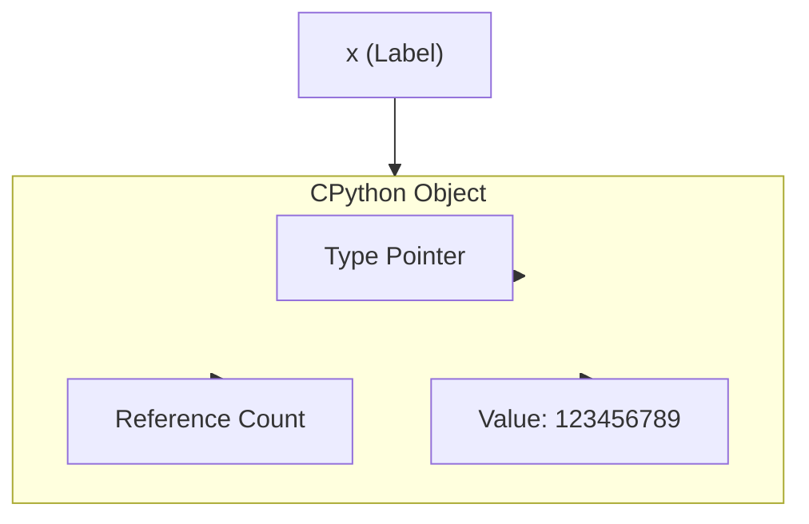
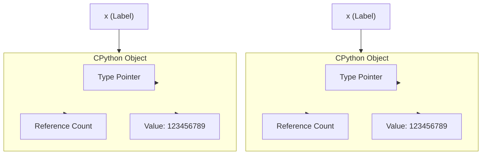
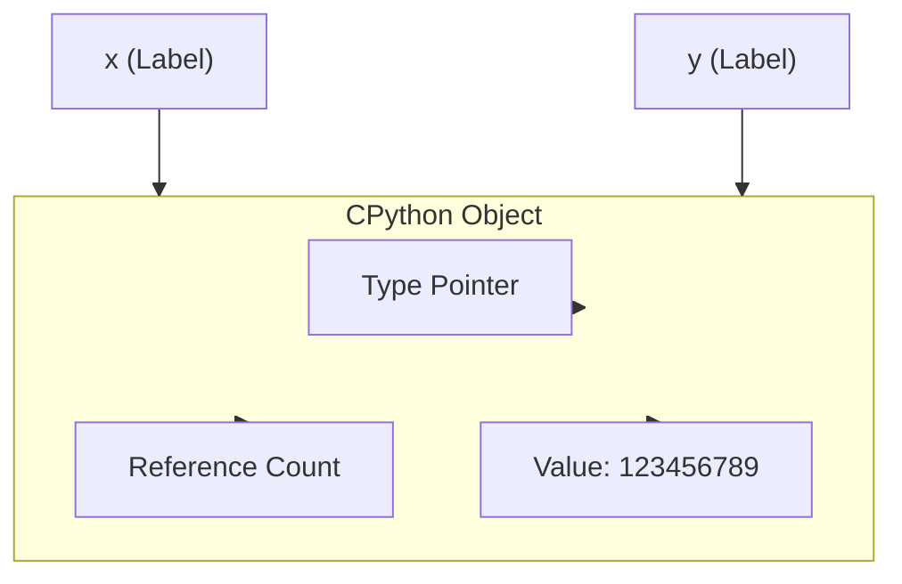

```python
#| code-fold: true
################################################################################

# autoreload all modules every time before executing the Python code
%reload_ext autoreload
%autoreload 2

################################################################################

from IPython.core.interactiveshell import InteractiveShell

# `ast_node_interactivity` is a setting that determines how the return value of the last line in a cell is displayed
# with `last_expr_or_assign`, the return value of the last expression is displayed unless it is assigned to a variable
InteractiveShell.ast_node_interactivity = "last_expr_or_assign"
```

The `holoviz` ecosystem is a powerful set of libraries that can help build interactive dashboards and UIs. The `param` library is a core piece of the `holoviz` ecosystem. Understanding how this library underneath it all works can help you build more interactive, flexible, and reusable code. In this post, we will build a tiny param library to understand how things works.

## Background

You may have already heard that in Python, pretty much _everything_ is an object. What this means in practice is that in Python, there exists an allocated piece of memory which represents some data that has an address and a label that points to that address.


```python
x = 123456789
```


    123456789


```python
type(x)
```


    int


In this statement above, `x` is a "label" that points to the "memory address of an object" that contains the value `123456789` and the object that `x` points to is of type `int`. 



In this post you'll see language like "`x` is a "label" to the value `123456789`", but most commonly, people refer to `x` as a **variable**.

The **address** of a "label" or "variable" can be found using the `id()` function.


```python
hex(id(x))
```


    '0x105860b90'


Notice that if we create overwrite the `x` label with an assignment to a _new_ object with the same value, the `id()` function will return a different address.


```python
x = 123456789
```


    123456789


```python
hex(id(x))
```


    '0x105860cb0'




But if we create a _new_ `y` binding to the _same_ object, the `id()` function will return the same address.


```python
y = x
```


    123456789


```python
hex(id(y))
```


    '0x105860cb0'


```python
hex(id(x)) == hex(id(y))
```


    True




::: callout-note

Interestingly, Python caches small integers and strings, so the `id()` function will return the same address for small integers and strings.


```python
x = 42
y = 42
hex(id(x)) == hex(id(x))
```


    True


```python
x = 123456789
y = 123456789
hex(id(x)) == hex(id(y))
```


    False


:::


This example shows integers, because even though they are immutable and even though they are built-in types and one of most basic units of data, they are still "objects" in Python. Pretty much everything in python is an "object".

Most commonly, when people say "object" in Python, they are referring to "instances of a class". 


```python
class Foo:
    ...

f = Foo()
```


    <__main__.Foo at 0x1058654f0>


Python prints the address of the object when you print an instance of a class.


```python
hex(id(f))
```


    '0x1058654f0'


In Python, classes, modules, functions, and methods are all objects. They all are "labels" or "variables" that point to an address in memory.


```python
def my_func():
    print("hello world")
```


```python
hex(id(my_func))
```


    '0x105833420'


And in Python, we can assign a new "label" or a new "variable" to the same function object.


```python
x = my_func
```


    <function __main__.my_func()>


```python
x()
```

    hello world


The other key piece of background information is that in Python, when calling a function, the arguments are "passed by reference" and assigned to the variables in the arguments of function. This means that when you pass an argument to a function, you are passing the address of the object that the argument points to. 


```python
def print_id_of_arg(arg):
    print(hex(id(arg)))
```


```python
print_id_of_arg(my_func)
```

    0x105833420


This is equivalent to executing the following code:


```python
arg = my_func
print(hex(id(arg)))
```

    0x105833420


And it doesn't matter what the name of the label is, only the address of the object that the label points to, and the object and type of the object at that address is important.


```python
print_id_of_arg(x)
```

    0x105833420


With that background, let's build a tiny param library to understand how it works.

## Understanding properties and descriptors in Python

In Python, a property is a special kind of attribute that allows you to define custom behavior when getting or setting the value of an attribute. Properties are defined using the `property()` function or by using the `@property` decorator.
The `property()` function takes four arguments: `fget`, `fset`, `fdel`, and `doc`. The first three arguments are functions that define the behavior of the property when getting, setting, or deleting the attribute. The fourth argument is a string that provides documentation for the property.

Let's say you wanted to build a person class:


```python
class Person:
    def __init__(self, name, age):
        self.name = name
        self.age = age

    def __repr__(self):
        return f"Person(name={self.name}, age={self.age})"

person = Person("Alice", 30)

person.age += 1

person
```


    Person(name=Alice, age=31)


But you want to make sure that the `age` attribute is always a positive integer. You can use a property to enforce this constraint.


```python

class Person:
    def __init__(self, name, age):
        self.name = name
        self._age = None
        self.age = age  # Use the setter to set the initial value

    @property
    def age(self):
        return self._age

    @age.setter
    def age(self, value):
        if not isinstance(value, int) or value < 0:
            raise ValueError("Age must be a positive integer")
        self._age = value

    @age.deleter
    def age(self):
        del self._age
        self._age = None

    def __repr__(self):
        return f"Person(name={self.name}, age={self.age})"
p = Person("Alice", 30)


```


    Person(name=Alice, age=30)


```python
p.age = 35
p
```


    Person(name=Alice, age=35)


```python
p.age = -5

```


    ---------------------------------------------------------------------------

    ValueError                                Traceback (most recent call last)

    Cell In[36], line 1
    ----> 1 p.age = -5  # Raises ValueError: Age must be a positive integer


    Cell In[35], line 14, in Person.age(self, value)
         11 @age.setter
         12 def age(self, value):
         13     if not isinstance(value, int) or value < 0:
    ---> 14         raise ValueError("Age must be a positive integer")
         15     self._age = value


    ValueError: Age must be a positive integer


This can also be done using a descriptor. A descriptor is an object that defines the behavior of an attribute when it is accessed or modified. Descriptors are defined by creating a class that implements the `__set_name__`, `__get__`, `__set__`, and `__delete__` methods.

In this case, we can create a `PositiveInteger` descriptor that enforces the constraint that the value is always a positive integer. The `__get__` method is called when the attribute is accessed, and the `__set__` method is called when the attribute is modified. The `__delete__` method is called when the attribute is deleted. The `__set_name__` method is called when the descriptor is created, and it allows us to set the name of the attribute in the class.


```python
class PositiveInteger:
    def __set_name__(self, owner, name):
        self.name = name

    def __get__(self, instance, owner):
        return instance.__dict__[self.name]

    def __set__(self, instance, value):
        if not isinstance(value, int) or value < 0:
            raise ValueError(f"{self.name} must be a positive integer")
        instance.__dict__[self.name] = value

    def __delete__(self, instance):
        del instance.__dict__[self.name]

class Person:
    age = PositiveInteger()

    def __init__(self, name, age):
        self.name = name
        self.age = age

    def __repr__(self):
        return f"Person(name={self.name}, age={self.age})"


p = Person("Alice", 30)

p.age = 35

p
```


    Person(name=Alice, age=35)


```python

p.age = -5
```


    ---------------------------------------------------------------------------

    ValueError                                Traceback (most recent call last)

    Cell In[47], line 1
    ----> 1 p.age = -5


    Cell In[46], line 10, in PositiveInteger.__set__(self, instance, value)
          8 def __set__(self, instance, value):
          9     if not isinstance(value, int) or value < 0:
    ---> 10         raise ValueError(f"{self.name} must be a positive integer")
         11     instance.__dict__[self.name] = value


    ValueError: age must be a positive integer


Descriptors are a powerful feature of Python that allows you to define custom behavior for attributes. They are used in many built-in types and libraries, including the `param` library.

## Callbacks


```python

```


```python
class Parameter:
  """Base class for all parameters in our tiny param library."""

  def __init__(self, default=None, doc=None, bounds=None, readonly=False):
    self.default = default
    self.name = None  # Will be set when the parameter is added to a parameterized class
    self._callbacks = []

  def __set_name__(self, owner, name):
    """Called when the parameter is defined in a class."""
    self.name = name

  def __get__(self, instance, owner):
    """Get the parameter value from the instance."""
    return instance._param_values.get(self.name, self.default)

  def __set__(self, instance, value):
    """Set the parameter value on the instance."""
    if self.readonly:
      raise ValueError(f"Parameter '{self.name}' is readonly")

    # Store the old value for callbacks
    old_value = instance._param_values.get(self.name, self.default)

    # Set the value
    instance._param_values[self.name] = value

    # Trigger callbacks if value changed
    if old_value != value:
      for callback in self._callbacks:
        callback(instance, self.name, old=old_value, new=value)

  def watch(self, callback):
    """Add a callback to be called when this parameter changes."""
    self._callbacks.append(callback)
    return callback

class Number(Parameter):
  """A numeric parameter with optional bounds."""

  def validate(self, value):
    """Ensure the value is a number and within bounds."""
    if not isinstance(value, (int, float)):
      raise ValueError(f"Parameter '{self.name}' must be a number")

    if self.bounds is not None:
      min_val, max_val = self.bounds
      if value < min_val or value > max_val:
        raise ValueError(f"Parameter '{self.name}' must be between {min_val} and {max_val}")

    return value

class String(Parameter):
  """A string parameter."""

  def validate(self, value):
    """Ensure the value is a string."""
    if not isinstance(value, str):
      raise ValueError(f"Parameter '{self.name}' must be a string")
    return value

class Parameterized:
  """Base class for objects with parameters."""

  def __init__(self, **kwargs):
    # Store parameter values
    self._param_values = {}

    # Set parameters from kwargs
    for name, value in kwargs.items():
      setattr(self, name, value)

  @classmethod
  def param(cls):
    """Get a dict of all parameters defined on this class."""
    params = {}
    for name, value in cls.__dict__.items():
      if isinstance(value, Parameter):
        params[name] = value
    return params

# Example usage
class Person(Parameterized):
  name = String(default="John", doc="Person's name")
  age = Number(default=30, bounds=(0, 120), doc="Person's age")

  def __repr__(self):
    return f"Person(name={self.name}, age={self.age})"

# Demonstrate the library
person = Person(name="Alice", age=25)
print(person)

# Change the age
person.age = 26


```


    ---------------------------------------------------------------------------

    ValueError                                Traceback (most recent call last)

    Cell In[27], line 94
         91     return f"Person(name={self.name}, age={self.age})"
         93 # Demonstrate the library
    ---> 94 person = Person(name="Alice", age=25)
         95 print(person)
         97 # Change the age


    Cell In[27], line 74, in Parameterized.__init__(self, **kwargs)
         72 # Set parameters from kwargs
         73 for name, value in kwargs.items():
    ---> 74   setattr(self, name, value)


    Cell In[27], line 23, in Parameter.__set__(self, instance, value)
         21 """Set the parameter value on the instance."""
         22 if self.readonly:
    ---> 23   raise ValueError(f"Parameter '{self.name}' is readonly")
         25 # Store the old value for callbacks
         26 old_value = instance._param_values.get(self.name, self.default)


    ValueError: Parameter 'name' is readonly


```python

```


```python

```
