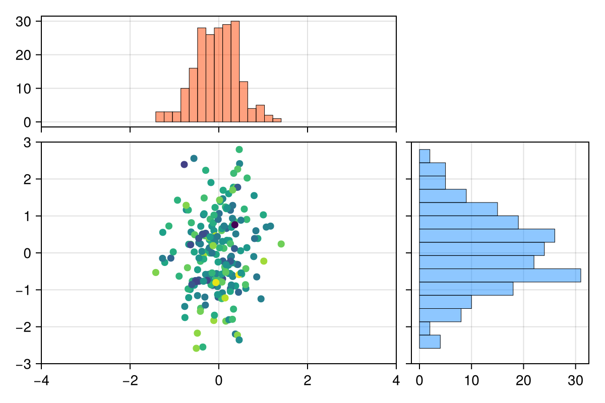

Here's an example of a static image generated using `CairoMakie`:

::::div{.cell}
<details class="code-fold">
<summary>Code</summary>

``` {.julia .cell-code}
using CairoMakie, Random

Random.seed!(123)
n = 200
x, y, color = randn(n) / 2, randn(n), randn(n)
fig = Figure(size=(600, 400))
ax1 = Axis(fig[1, 1])
ax2 = Axis(fig[2, 1])
ax3 = Axis(fig[2, 2])
hist!(ax1, x; color=(:orangered, 0.5), strokewidth=0.5)
scatter!(ax2, x, y; color=color, markersize=10, strokewidth=0)
hist!(ax3, y; direction=:x, color=(:dodgerblue, 0.5),
  strokewidth=0.5)
xlims!(ax1, -4, 4)
limits!(ax2, -4, 4, -3, 3)
ylims!(ax3, -3, 3)
hideydecorations!(ax3, ticks=false, grid=false)
hidexdecorations!(ax1, ticks=false, grid=false)
colsize!(fig.layout, 1, Relative(2 / 3))
rowsize!(fig.layout, 1, Relative(1 / 3))
colgap!(fig.layout, 10)
rowgap!(fig.layout, 10)
current_figure()
```

</details>

:::div{.cell-output .cell-output-display}

:::
::::
