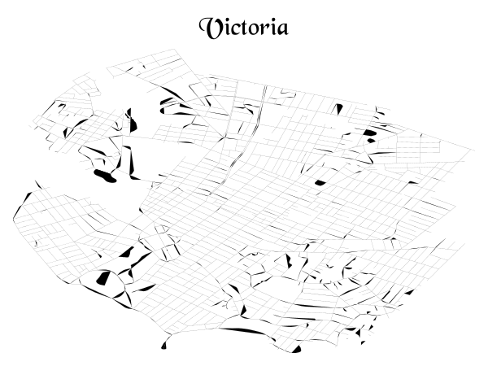

Let's import some packages first.

:::div{.cell}
``` {.julia .cell-code}
using GeoMakie
using GeoInterfaceMakie
using GeoInterface
using CairoMakie
using Shapefile
using DataFrames
using DataFramesMeta
using StringEncodings
using Pkg.Artifacts
```
:::

If you want to run this interactively, you can replace `CairoMakie` with
`GLMakie`, i.e.

``` diff
- import CairoMakie
+ import GLMakie
```

## Data

Representations of Canada's national road network are available from
[Statistics
Canada](https://www12.statcan.gc.ca/census-recensement/2011/geo/RNF-FRR/index-eng.cfm).

:::::div{.cell}
``` {.julia .cell-code}
artifact_roadnetwork = Pkg.Artifacts.ensure_artifact_installed("roadnetwork", joinpath(@__DIR__, "Artifacts.toml"))
path = joinpath(artifact_roadnetwork, "lrnf000r21a_e.shp")
@time gdf = DataFrame(Shapefile.Table(path));
@show size(gdf)
first(gdf, 1)
```

:::div{.cell-output .cell-output-display}
     35.535843 seconds (169.74 M allocations: 8.115 GiB, 23.57% gc time, 1.44% compilation time)
    size(gdf) = (2242117, 26)
:::

:::div{.cell-output .cell-output-display}
|  | geometry |  |
| --- | --- | --- |
| 1 | Polyline(Rect(7.65014e6, 1.27149e6, 7.65038e6, 1.2717e6), Int32[0], Point[Point(7.65014e6, 1.27149e6), Point(7.65017e6, 1.2715e6), Point(7.6502e6, 1.27152e6), Point(7.65023e6, 1.27153e6), Point(7.65024e6, 1.27154e6), Point(7.65027e6, 1.27156e6), Point(7.6503e6, 1.27158e6), Point(7.65031e6, 1.27159e6), Point(7.65033e6, 1.27162e6), Point(7.65035e6, 1.27164e6), Point(7.65036e6, 1.27166e6), Point(7.65037e6, 1.27169e6), Point(7.65038e6, 1.2717e6)]) | $\dots$ |
:::
:::::

The documentation says `CSDNAME` is the "Census subdivision name", which
seems to map to cities.

Let's convert it to a proper encoding first:

::::div{.cell}
``` {.julia .cell-code}
latin1_to_utf8(s) = decode(Vector{UInt8}(String(coalesce(s, ""))), "Windows-1252")
@time @rtransform! gdf begin
  :CSDNAME_L_UTF8 = latin1_to_utf8(:CSDNAME_L)
  :CSDNAME_R_UTF8 = latin1_to_utf8(:CSDNAME_R)
end
nothing #| hide_line
```

:::div{.cell-output .cell-output-display}
     17.307230 seconds (107.98 M allocations: 9.264 GiB, 31.09% gc time, 1.18% compilation time: 7% of which was recompilation)
:::
::::

## Visualizations

We can now create a plot for each city using Makie:

:::div{.cell}
``` {.julia .cell-code}
CairoMakie.activate!(pt_per_unit=1.0, type = "svg")
```
:::

:::div{.cell}
<details class="code-fold">
<summary>Code</summary>

``` {.julia .cell-code}
function plot_city(gdf, city_name, province = nothing)
  if isnothing(province)
    df = @rsubset gdf (:CSDNAME_L_UTF8 == city_name || :CSDNAME_R_UTF8 == city_name)
  else
    df = @rsubset gdf (( :CSDNAME_L_UTF8 == city_name || :CSDNAME_R_UTF8 == city_name ) && contains(:PRNAME_L, province))
  end
  # if province
  #   df = @rsubset df
  # end
  empty_theme = Theme(
    fonts=(; weird="Blackchancery"),
    fontsize=32,
    Axis=(
      backgroundcolor=:transparent,
      leftspinevisible=false,
      rightspinevisible=false,
      bottomspinevisible=false,
      topspinevisible=false,
      xticklabelsvisible=false,
      yticklabelsvisible=false,
      xgridcolor=:transparent,
      ygridcolor=:transparent,
      xminorticksvisible=false,
      yminorticksvisible=false,
      xticksvisible=false,
      yticksvisible=false,
      xautolimitmargin=(0.0, 0.0),
      yautolimitmargin=(0.0, 0.0),
      titlefont=:weird,
    ),
  )
  with_theme(empty_theme) do
    fig = Figure()
    ax = Axis(fig[1, 1])
    poly!.(GeoInterface.convert.(Ref(CairoMakie.GeometryBasics), df[:, :geometry]); strokewidth=0.1, strokecolor=:black, color=:black)
    ax.title = city_name
    fig
  end
end;
```

</details>
:::

::::div{.cell}
``` {.julia .cell-code}
plot_city(gdf, "Toronto")
```

:::div{.cell-output .cell-output-display}

:::
::::

::::div{.cell}
``` {.julia .cell-code}
plot_city(gdf, "Montréal")
```

:::div{.cell-output .cell-output-display}

:::
::::

::::div{.cell}
``` {.julia .cell-code}
plot_city(gdf, "Vancouver")
```

:::div{.cell-output .cell-output-display}

:::
::::

::::div{.cell}
``` {.julia .cell-code}
plot_city(gdf, "Ottawa")
```

:::div{.cell-output .cell-output-display}

:::
::::

::::div{.cell}
``` {.julia .cell-code}
plot_city(gdf, "Calgary")
```

:::div{.cell-output .cell-output-display}

:::
::::

::::div{.cell}
``` {.julia .cell-code}
plot_city(gdf, "Edmonton")
```

:::div{.cell-output .cell-output-display}

:::
::::

::::div{.cell}
``` {.julia .cell-code}
plot_city(gdf, "Winnipeg")
```

:::div{.cell-output .cell-output-display}

:::
::::

::::div{.cell}
``` {.julia .cell-code}
plot_city(gdf, "Victoria", "British Columbia")
```

:::div{.cell-output .cell-output-display}

:::
::::
